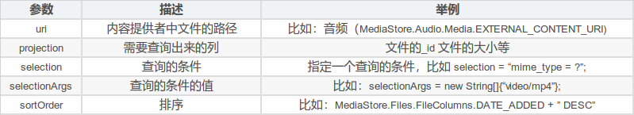

 
## app端 待完成
- [x] 本地歌单
- [x] 展示歌曲封面  audio_service示例中的方法不太行，试试on_audio_query  (插件和示例方法都不行，估计歌曲都不带元信息，所以查不到，只能网络下载了)
- [x] 创建歌单时 选择图片 如何回显图片(在dialog中)  
- [x] 侧滑删除 将歌曲从歌单删除  
- [x] 歌单列表 不存在的歌曲 灰色显示(目前播放还是会加入播放列表，但是不存在会跳过)  
- [x] 歌单列表 没有点击样式了
- [ ] 本地音乐 增加 单曲 歌手 封面 文件夹 吸顶bar  
- [x] 多选歌曲 添加到歌单  
- [ ] 歌词  
- [ ] 均衡器  

## 服务端
- [ ] 歌单同步到服务端  
- [ ] 歌曲文件存储  
- [ ] 微信qq其他登录  
- [ ] 歌曲 歌词 封面 下载  
- [ ] 视频  

## BUG
每次点击不同的歌单，后台会在通知栏创建很多个播放通知界面  
写一个工厂方法类 貌似解决。
```dart
//原先没有工厂类 多个歌单切歌就会创建多个通知栏，难道init方法在插件中调用多次。但是插件中代码onMethodCall在收到configure才初始化
//或者时因为每次从GetIt取audioHandler，都在重新初始化audioHandler
final audioHandler = await AudioService.init(
    builder: () => AudioPlayerHandlerImpl(),
    config: AudioServiceConfig(
    androidNotificationChannelId: 'wuhou.music.channel.audio',
    androidNotificationChannelName: 'wuhou music',
    // androidNotificationIcon: 'drawable/ic_stat_music_note',
    androidShowNotificationBadge: true,
    androidStopForegroundOnPause: false,
  ),
);
GetIt.I.registerSingleton<AudioPlayerHandler>(audioHandler);
static final AudioPlayerHandler audioPlayerHandler = GetIt.I<AudioPlayerHandler>();

// 查看get_it文档，并不是传实例进去。
GetIt.instance.registerSingleton<AppModel>(AppModelImplementation());
GetIt.I.registerLazySingleton<RESTAPI>(() => RestAPIImplementation());

//应该注册完之后 测试是否是单例
```


## 下拉上拉库 
pull_to_refresh_flutter3 子组件有图片刷新就会ui变形，而且不维护了  
easy_refresh 完美

## android 查询媒体文件 类ContentResolver
MediaStore.Audio.Media.EXTERNAL_CONTENT_URI：存储在手机外部存储器上的音频文件Uri路径。  
MediaStore.Audio.Media.INTERNAL_CONTENT_URI：存储在手机内部存储器上的音频文件Uri路径。  
MediaStore.Images.Media.EXTERNAL_CONTENT_URI：存储在手机外部存储器上的图片文件Uri路径。  
MediaStore.Images.Media.INTERNAL_CONTENT_URI：存储在手机内部存储器上的图片文件Uri路径。  
MediaStore.Video.Media.EXTERNAL_CONTENT_URI：存储在手机外部存储器上的视频文件Uri路径。  
MediaStore.Video.Media.INTERNAL_CONTENT_URI：存储在手机内部存储器上的视频文件Uri路径。

Image(图片)	content://media/external/images/media	MediaStore.Images.Media.EXTERNAL_CONTENT_URI	Pictures	DCIM、Pictures  
Audio(音频)	content://media/external/audio/media	MediaStore.Audio.Media.EXTERNAL_CONTENT_URI	Music	Alarms、Music、Notifications、Podcasts、Ringtones  
Video(视频)	content://media/external/video/media	MediaStore.Video.Media.EXTERNAL_CONTENT_URI	Movies	DCIM 、Movies  
Download(下载文件)	content://media/external/downloads	MediaStore.Downloads.EXTERNAL_CONTENT_URI	Download	Download

查询方法：query  
Uri：这个Uri代表要查询的内容提供者的Uri。上文说到多媒体类型的Uri一般都直接从MediaStore里取得，例如我要取所有图片的信息，就必须利用MediaStore.Images.Media.EXTERNAL_CONTENT_URI这个Uri。  
projection： 代表告诉Provider要返回的字段内容（列Column），用一个String数组来表示。用null表示返回Provider的所有字段内容（列Column）。  
selection：相当于SQL语句中的where子句，就是代表查询条件。null表示不进行添加筛选查询。  
selectArgs：如果selection里有？这个符号时，这里可以以实际值代替这个问号。如果Selections这个没有？的话，那么这个String数组可以为null。  
sortOrder：说明查询结果按什么来排序。相当于SQL语句中的Order by，升序 asc /降序 desc，null为默认排序


类型：MimeType  
Image(图片)	content://media/external/images/media	MediaStore.Images.Media.EXTERNAL_CONTENT_URI	image/*	Pictures	DCIM、Pictures  
Audio(音频)	content://media/external/audio/media	MediaStore.Audio.Media.EXTERNAL_CONTENT_URI	audio/*	Music	Alarms、Music、Notifications、Podcasts、Ringtones  
Video(视频)	content://media/external/video/media	MediaStore.Video.Media.EXTERNAL_CONTENT_URI	video/*	Movies	DCIM 、Movies  
Files(下载)	content://media/external/downloads	MediaStore.Downloads.EXTERNAL_CONTENT_URI	file/*	Download	Download

音频文件比较常见的列名有:  
MediaStore.Audio.Media.TITLE：歌名  
MediaStore.Audio.Media.ARTIST：歌手  
MediaStore.Audio.Media.DURATION：总时长  
MediaStore.Audio.Media.DATA：地址  
MediaStore.Audio.Media.SIZE：大小

视频文件比较常见的列名有:  
MediaStore.Video.Media.TITLE 名称  
MediaStore.Video.Media.DURATION 总时长  
MediaStore.Video.Media.DATA 地址  
MediaStore.Video.Media.SIZE 大小  
MediaStore.Video.Media.WIDTH：视频的宽度，以像素为单位。  
MediaStore.Video.Media.HEIGHT：视频的高度，以像素为单位

图片文件比较常见的列名有:  
MediaStore.Images.Media._ID：磁盘上文件的路径  
MediaStore.Images.Media.DATA：磁盘上文件的路径  
MediaStore.Images.Media.DATE_ADDED：文件添加到media provider的时间（单位秒）  
MediaStore.Images.Media.DATE_MODIFIED：文件最后一次修改单元的时间  
MediaStore.Images.Media.DISPLAY_NAME：文件的显示名称  
MediaStore.Images.Media.HEIGHT：图像/视频的高度，以像素为单位  
MediaStore.Images.Media.MIME_TYPE：文件的MIME类型  
MediaStore.Images.Media.SIZE：文件的字节大小  
MediaStore.Images.Media.TITLE：标题  
MediaStore.Images.Media.WIDTH：图像/视频的宽度，以像素为单位。 

